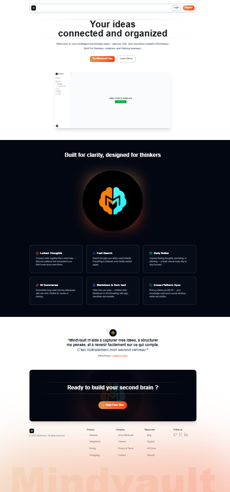

# krypt-frontend | Next.js + TypeScript + TailwindCSS

<p align="center">
  
</p>

---

## Overview

This frontend project is developed with **Next.js**, **TypeScript**, and **TailwindCSS**.  
It provides a modern, responsive landing page that demonstrates:

- **Reusable components**: `Button`, `Card`, `Input`, `Badge`, etc.  
- **Common landing page sections**: Hero, Features, Testimonials, Call to Action, Footer.  
- **Consistent design system** with global CSS variables.  
- **Responsive and accessible** implementation, ready for production.  
- Easy extension to additional pages such as a dashboard or editor.

---

## Technologies

- [Next.js](https://nextjs.org/)  
- [TypeScript](https://www.typescriptlang.org/)  
- [TailwindCSS](https://tailwindcss.com/)  
- [Lucide Icons](https://lucide.dev/) for iconography  
- [Tiptap](https://tiptap.dev/) for optional rich-text editing  

---

## Project Architecture

```text
src/
 └─ app
     ├─ landing
     │   ├─ components
     │   │   ├─ Header.tsx
     │   │   ├─ Hero.tsx
     │   │   ├─ Features.tsx
     │   │   ├─ Testimonials.tsx
     │   │   ├─ CTA.tsx
     │   │   └─ Footer.tsx
     │   └─ page.tsx
     ├─ dashboard
     │   └─ components
     │       └─ ... (similar structure as landing)
     ├─ account-verified
     │   └─ components
     │       └─ ... (similar structure as landing)
     └─ login-register
         └─ components
             └─ ... (similar structure as landing)
 ├─ components
 │   ├─ atoms
 │   │   ├─ Button.tsx
 │   │   ├─ Badge.tsx
 │   │   └─ Card.tsx
 │   ├─ molecules
 │   │   └─ FeatureCard.tsx
 │   └─ feedback
 ├─ config
 ├─ hooks
 ├─ services
 ├─ styles
 │   ├─ globals.css
 │   ├─ editor.css
 │   ├─ landing.css
 │   └─ dashboard.css
 ├─ types
 └─ utils
```
